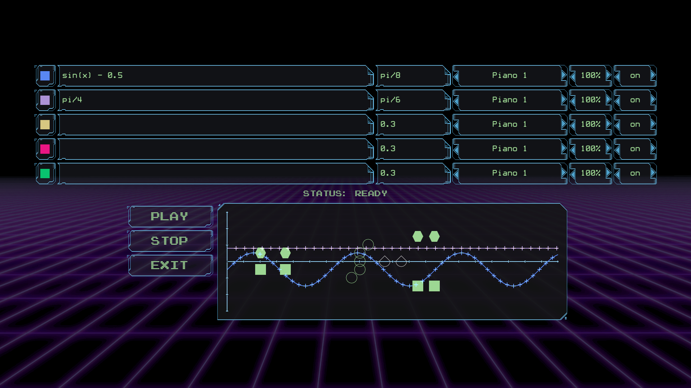

# Sinecord

A game submitted to [Ebitengine 2023 game jam](https://itch.io/jam/ebitengine-game-jam-2023).

Play in browser: [quasilyte.itch.io/sinecord](https://quasilyte.itch.io/sinecord)

In this game, you solve the puzzles and create the music along the way.

Here is an example what kind of music you can expect from this game: [www.youtube.com/watch?v=Yh3orYBQmcg](https://www.youtube.com/watch?v=Yh3orYBQmcg).



## Running the game

1. Install Ebitengine system dependencies for your OS
2. Build & run the game with Go

```bash
git clone https://github.com/quasilyte/sinecord.git
go run ./cmd/game
```
